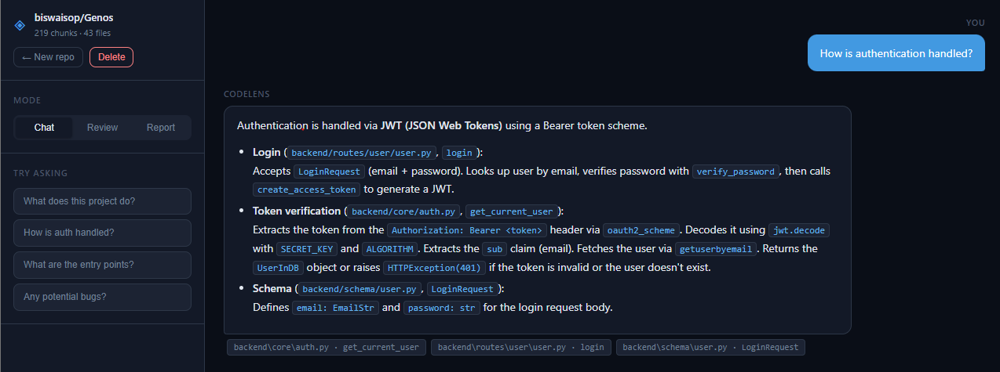
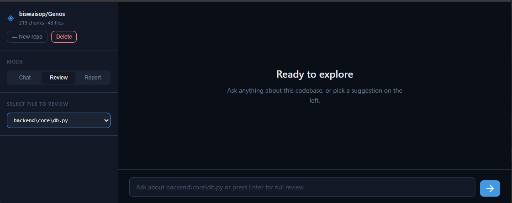
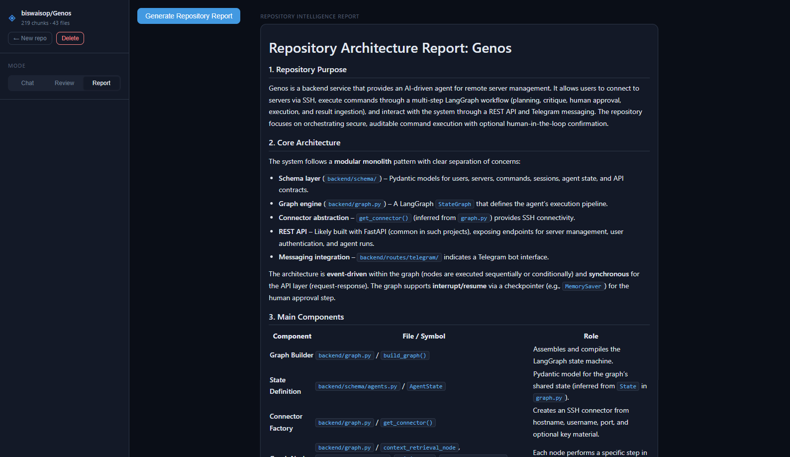

<p align="center">
  
</p>
<h1 align="center">CodeLens</h1>

<p align="center">
Query any public GitHub repository in plain English — ask questions, review files, or generate an architecture report.
</p>

<p align="justify">


</p>
<p align="center">

<a href="YOUR_RAILWAY_LINK">
Live Demo
</a>

</p>

# Overview
CodeLens indexes a repository's Python source code into a searchable knowledge base and lets you interrogate it through three modes: conversational Q&A, per-file code review, and full architecture reporting. The agent retrieves relevant code chunks, decides whether it needs to read additional files, and generates grounded answers that cite specific files and line ranges.

The problem it addresses is straightforward: reading an unfamiliar codebase requires piecing together information spread across dozens of files. Generic LLMs help with syntax but have no awareness of the specific codebase you're working in. CodeLens bridges that gap by building a persistent, searchable index of the actual repository and using it as the retrieval source for every answer.

# Demo

## Repository Indexing


---

## Chat Mode



---

## Review Mode



---

## Report Mode




# Architecture

<p align="center">

</p>
<p align="left">
  All three blocking operations — cloning, filesystem traversal, and embedding — run in asyncio.to_thread. Progress callbacks from inside the embed thread reach the async DB writer via asyncio.run_coroutine_threadsafe, which is the only safe way to schedule a coroutine from a non-async context.
</p>

<h3 align="left"> Request Flow </h3>

<p align="left">

</p>
<h3 align="center"> Mermaid </h3>

<p align="center">

</p>
<h3 align="center">Hybrid Retrieval</h3>

<p align="center">

</p>

# Repository Structure

<p align="center">

</p>

# Installation
<p align="left">
<h3> Prerequisites </h3>


Python 3.11+ <br>
Git<br>
A Groq API key (free tier)


Clone and set up
```
git clone https://github.com/your-username/codelens.git
cd codelens

python -m venv venv
source venv/bin/activate   # Windows: venv\Scripts\activate

pip install -r requirements.txt
```
</p>

#  How It Works?

<p align="left">
 <h3> 1. Submission</h3>

POST /api/repos/ with a GitHub URL creates a SQLite record with status=pending and schedules a background task. The API responds immediately with 202 Accepted and a repo_id.

<h3>2. Cloning</h3>

git clone --depth 1 fetches only the latest commit tree. Depth-1 is intentional — history is irrelevant for code search and would significantly increase clone time and disk usage. The clone is written to {REPO_STORAGE_PATH}/{repo_id}/.

<h3>3. File enumeration</h3>

os.walk traverses the clone, skipping __pycache__, .git, venv, node_modules, hidden directories, and files matching test_*.py or *_test.py. Returns absolute paths for all .py files up to MAX_FILES_PER_REPO.

<h3>4. AST chunking</h3>

For each file, ast.parse(source) builds a syntax tree. ast.walk visits every node; FunctionDef, AsyncFunctionDef, and ClassDef nodes are extracted by line range using node.lineno and node.end_lineno. Files with SyntaxError fall back to a single module-level chunk capped at 2000 characters. Chunks shorter than three lines are discarded. Chunks longer than 1500 characters are truncated.

Each chunk carries metadata: file_path, symbol_name, chunk_type, start_line, end_line.

<h3>5. Embedding</h3>

SentenceTransformer('all-MiniLM-L6-v2').encode() processes chunks in batches of 50 with normalize_embeddings=True. Normalised embeddings make cosine similarity equivalent to dot product, which ChromaDB uses internally. After each batch, a progress callback fires via asyncio.run_coroutine_threadsafe to write the running chunk_count to SQLite.

<h3>6. ChromaDB storage</h3>

Each repo gets an isolated collection named repo_{repo_id}. ChromaDB persists to {CHROMA_PERSIST_PATH} on disk. Isolation by collection means deleting a repo drops exactly one collection without touching others.

<h3>7. Query — hybrid retrieval</h3>

For a user query, the search tool runs in parallel:


- **BM25**: builds an in-memory BM25Okapi index over all documents in the collection (retrieved via collection.get()), scores the tokenised query against all documents
- **Semantic**: encodes the query with the same model and calls collection.query() for top-16 results


Both produce ranked lists. RRF merges them: each document accumulates 1/(60 + rank) from each list it appears in. The top-8 by RRF score are returned.

<h3>8. Agent loop</h3>

The planner receives the query, the formatted retrieved chunks, and the tool call history. It returns a JSON object:
```

json{
    "has_enough_context": false,
    "tool_name": "read_file",
    "tool_input": {"file_path": "backend/agents/criticagent.py"},
    "reasoning": "The retrieved chunks mention criticagent.py but don't include its evaluate_command function."
}
```

json_mode=True on the Groq call enforces valid JSON output. The tool executor runs the requested tool, appends the result to context, increments a counter, and the planner runs again. After three iterations the responder is called unconditionally.

<h3>9. Response generation</h3>

The responder receives the full context — retrieved chunks plus all tool call results — and generates a response according to the mode. Chat mode cites specific files and symbol names. Review mode follows a structured format: issues, suggestions, good patterns, summary. Report mode produces a full architecture walkthrough including a suggested file reading order.

# Design Decisions

**FastAPI over Flask**
FastAPI's native async/await support is load-bearing here. The indexing background task, SQLite queries, and the agent loop all use async patterns. Flask's sync-first model would require thread management that async handles more cleanly.

**ChromaDB over Pinecone or Qdrant**
ChromaDB runs in-process and persists to a local directory. For a project that runs as a single-process web app on Railway, adding a managed vector database would mean an external service dependency, API keys, and network latency on every query. ChromaDB's performance is adequate for repository-scale indexes (typically 50–500 chunks).

**Hybrid retrieval over semantic-only**
Pure semantic search fails on exact symbol lookups. If a user asks "where is route_after_planner defined", the embedding for that identifier doesn't strongly resemble any chunk's embedding. BM25 handles this via term matching. The tradeoff is that BM25 requires loading all documents into memory on each query, which is acceptable at this scale.

**AST chunking over character-based or line-based chunking**
A function split across two chunks is nearly useless in retrieval: the first chunk lacks the return statement, the second lacks the signature. By chunking at AST node boundaries, every chunk in the database is a syntactically complete unit. The ast module is part of Python's standard library, so this adds no dependency.

**SQLite over a document database**
The repos table has low write concurrency (one background task at a time) and simple query patterns (lookup by ID, list all). SQLite's single-file model means zero infrastructure. The tradeoff — no concurrent writes — is not a problem at this scale.

**Railway over Render or Fly.io**
Railway's automatic deploys from GitHub, environment variable management, and Dockerfile support required no additional configuration files. The free tier is sufficient for a portfolio project with light usage.

**sentence-transformers over the OpenAI embedding API**
Running the embedding model locally eliminates an API dependency and latency on every indexing operation. all-MiniLM-L6-v2 is 80 MB and runs on CPU in under a second per batch. The quality difference versus text-embedding-3-small is marginal for code retrieval tasks.

**rank-bm25 over Elasticsearch or Typesense**
The BM25 implementation from rank-bm25 is a single Python class. It operates on in-memory lists and returns scores synchronously. Adding a dedicated search engine for keyword matching would introduce the same infrastructure overhead that ChromaDB was chosen to avoid.

# Challenges

**Blocking the event loop during indexing**

The initial implementation ran clone_repo, chunk_repo, and embed_chunks directly inside the async background task. This froze the entire FastAPI event loop during execution — incoming polling requests would queue up and release together after indexing completed, making the progress bar appear to jump from 0 to done. The fix was wrapping each blocking call in asyncio.to_thread, which runs them in a thread pool while keeping the event loop free.

**Progress callbacks from a thread back to async**

embed_chunks runs inside a thread via asyncio.to_thread. From inside that thread, await update_repo_status(...) is not valid — you cannot await inside a regular function. The solution was capturing the running event loop before entering the thread with loop = asyncio.get_running_loop() and scheduling the coroutine from the thread using asyncio.run_coroutine_threadsafe(coro, loop). This is the only correct way to bridge thread-to-async in this pattern.

**Railway not expanding $PORT in Dockerfile CMD**

Railway injects the PORT environment variable at runtime. The natural fix — CMD ["uvicorn", "backend.main:app", "--port", "$PORT"] — does not work because the exec form of CMD does not invoke a shell, so $PORT is passed as a literal string. Using shell form (CMD sh -c "uvicorn ... --port ${PORT:-8000}") worked locally but failed in Railway's container runner. The reliable fix was a start.py launcher that reads os.environ.get("PORT", 8000) and calls uvicorn.run() programmatically.

**AST parsing failures**

Some Python files in real repositories contain syntax that is valid in a specific Python version but fails to parse in another, or contain encoding issues. A blanket try/except SyntaxError around ast.parse with a fallback to whole-file chunking handles this without silently skipping files.

**ChromaDB collection naming**

ChromaDB collection names must be 3–63 characters and match [a-zA-Z0-9_-]+. UUIDs contain hyphens and are 36 characters, which is valid, but the prefix repo_ plus a full UUID exceeds the limit. The implementation uses the first 8 characters of the UUID as the repo ID, keeping the collection name well within limits while remaining unique enough for a single-user tool.

# Future Improvements


- **Multi-language support** — the chunker currently handles only Python. Tree-sitter has grammars for most languages and would be the natural replacement for the language-specific ast approach.
- **Persistent storage** — Railway's free tier uses ephemeral disk; a Railway volume or an external ChromaDB instance would survive restarts.
- **Incremental re-indexing** — currently the only option is delete and re-index. Tracking file content hashes would allow re-embedding only changed files.
- **Streaming responses** — the responder generates the full answer before sending. Groq supports token streaming via the OpenAI-compatible API; wiring this to Server-Sent Events would reduce perceived latency on long answers.
- **Non-Python file support** — README.md, Dockerfile, pyproject.toml, and similar files contain useful architectural context that is currently ignored.

# Tech Stack

<p align="center">

</p>

# Contributing
```
bash
git clone https://github.com/chirag1234singh-alt/CodeLens.git

cd CodeLens

python -m venv venv

# Windows
venv\Scripts\activate

# macOS / Linux
source venv/bin/activate

pip install -r requirements.txt
```

Create a `.env` file in the project root:

```env
GROQ_API_KEY=your_groq_key

# Optional (recommended)
NVIDIA_API_KEY=your_nvidia_key
```

Start the application:

```bash
python start.py
```

Open:

```
http://localhost:8000
```
If you'd like to contribute:

1. Fork the repository.
2. Create a feature branch.
3. Make your changes.
4. Test the project locally.
5. Open a Pull Request describing what was changed and why.

There are no automated tests currently. Manual testing against a known repository is expected before opening a PR.

# License
MIT License - See LICENSE

# Author

**Chirag Singh**

- GitHub: https://github.com/chirag1234singh-alt
- LinkedIn: https://www.linkedin.com/in/chiragsingh-sd/


